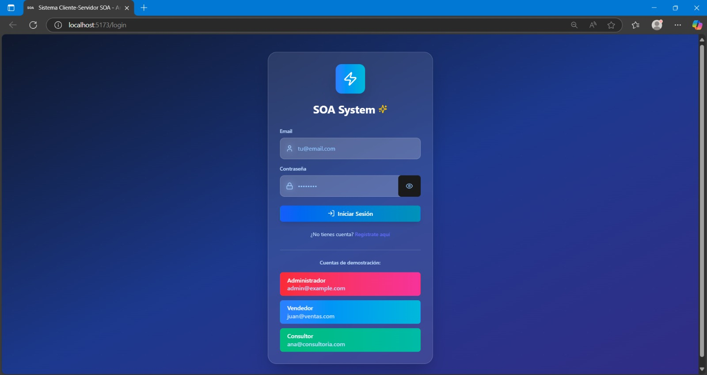
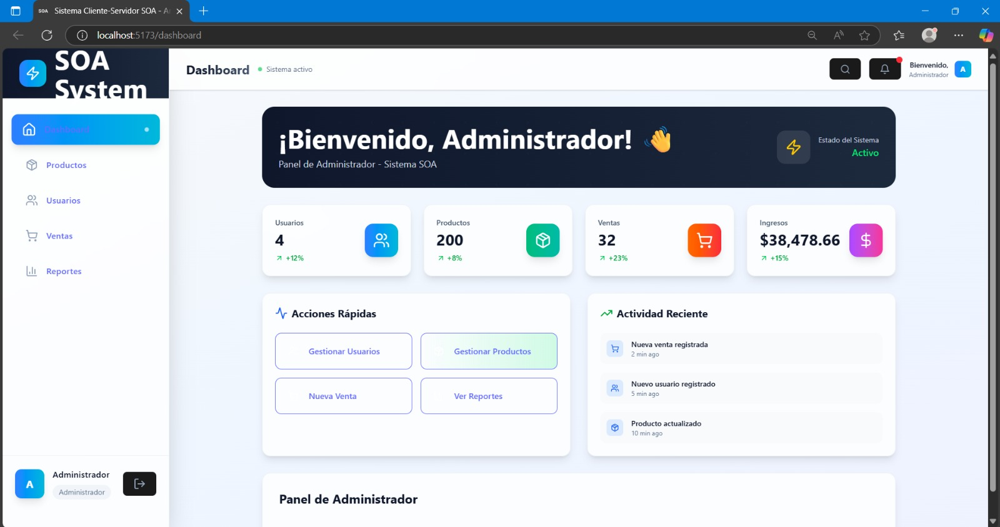
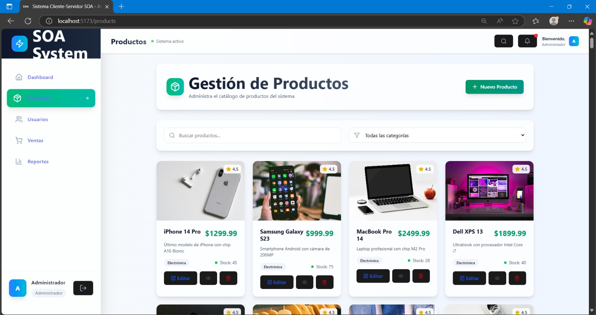
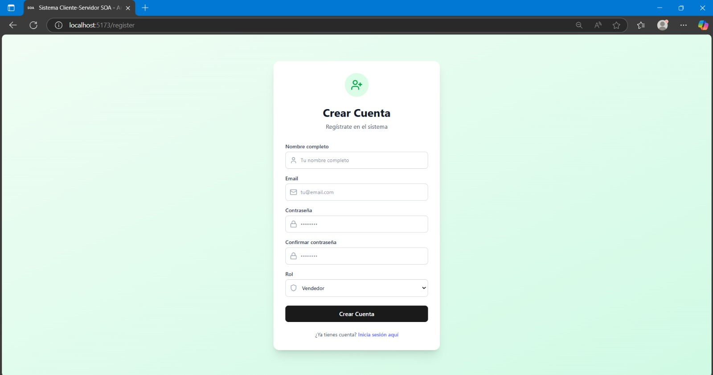
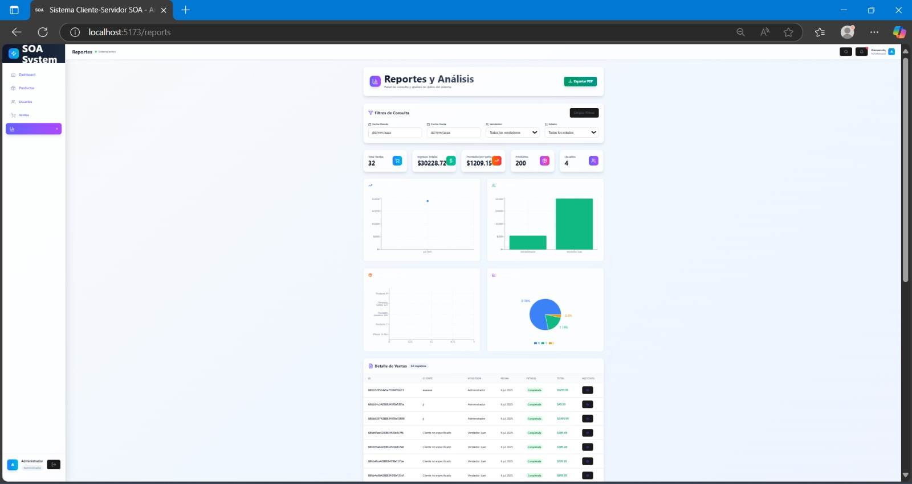
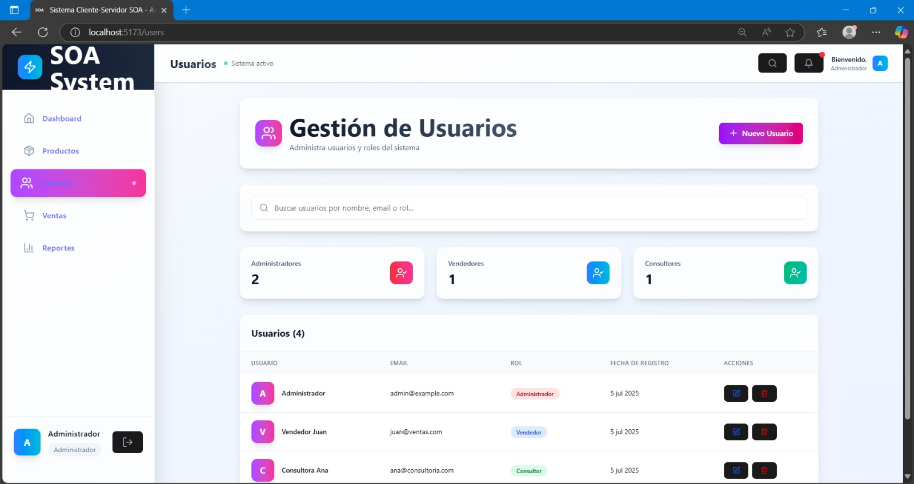
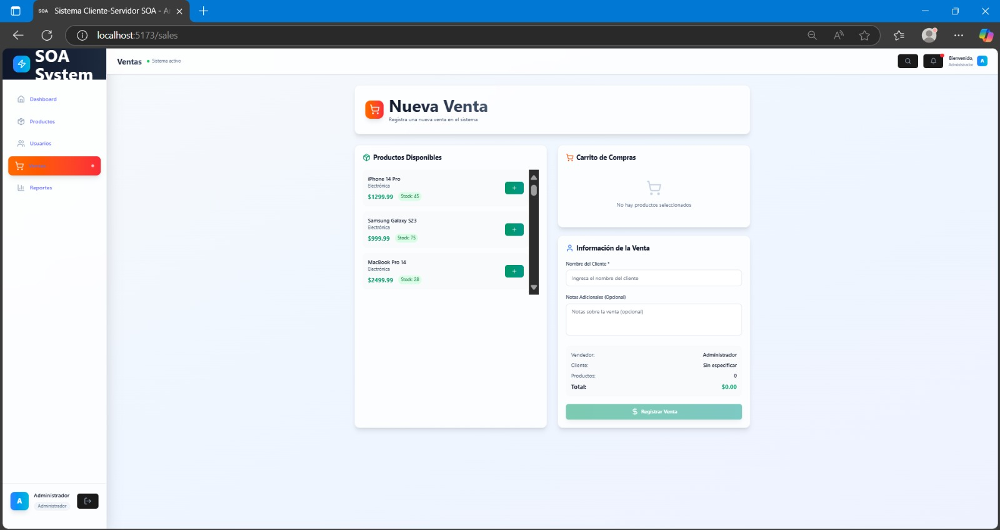

# 🏗️ SOA System

This repository contains a **Service-Oriented Architecture (SOA) system** with separate frontend and backend components.  
It includes a React/Vite frontend and two backends: Node.js (Users & Sales) and Flask/Python (Products).

---

## 📂 Repository Structure

    soa_system/
    ├── client/            # Frontend React + Vite
    ├── backend1/          # Backend Node.js (Users & Sales)
    ├── backend2/          # Backend Flask / Python (Products)
    ├── .gitignore         # Files and folders ignored by Git
    └── README.md          # This file

---

## 🖼️ Screenshots

> Click any screenshot to open the full-resolution image.

### Login
  

### Dashboard
  

### Productos
  

### Register
  

### Reportes
  

### Usuarios
  

### Ventas
  

---
## ⚙️ Components

### 1️⃣ Frontend (client/)
- Technology: **React + Vite + TailwindCSS**
- Functionality: UI (PWA), authentication, consuming backend APIs
- Communication: HTTP/HTTPS with backend REST endpoints

Key folders:
    src/      — React components, pages, hooks, styles
    public/   — static assets
    vite.config.js — Vite configuration

Setup & Run:
    cd client
    npm install
    npm run dev      # start development server
    npm run build    # production build

---

### 2️⃣ Backend 1 — Users & Sales (backend1/)
- Technology: **Node.js + Express + MongoDB**
- Responsibilities:
    - JWT Authentication
    - User management
    - Sales management
    - Role control / authorization

Key folders/files:
    src/ or controllers/ — API routes and controllers
    models/              — database models
    package.json         — dependencies

Setup & Run:
    cd backend1
    npm install
    npm run dev      # development server
    npm start        # production server

Note: Use a `.env` file for DB URI, JWT secrets, PORT (example: PORT=3001).

---

### 3️⃣ Backend 2 — Products (backend2/)
- Technology: **Flask + MySQL**
- Responsibilities:
    - Products CRUD
    - Data validation
    - Swagger documentation

Key folders/files:
    app.py or main.py   — entry point
    routes/             — blueprint modules
    models/             — DB models (SQLAlchemy)
    requirements.txt    — Python dependencies

Setup & Run:
    cd backend2
    python -m venv venv
    source venv/bin/activate      # Linux/macOS
    venv\Scripts\activate         # Windows
    pip install -r requirements.txt
    flask run                     # start development server

Note: Use a `.env` or config file for DATABASE_URI, SECRET_KEY, PORT (example: PORT=5000).

---

## 🏛️ System Architecture (SOA)

### Overview
A client-server, service-oriented distributed system with clear separation of responsibilities. Each service can scale independently and exposes a REST API.

### Main Components & Ports
- **Client PWA (port 3000)**  
  - React + Vite + TailwindCSS  
  - Handles UI, authentication, and calls backend APIs
- **Backend 1 — Users & Sales (port 3001)**  
  - Node.js + Express + MongoDB  
  - JWT auth, user and sales management, role control
- **Backend 2 — Products (port 5000)**  
  - Flask + MySQL  
  - CRUD for products, validation, Swagger docs

### Communication Flow (ASCII)
    Client PWA (React)
        ↓
        ├── Backend 1 (Node.js) → MongoDB
        ├── Backend 2 (Flask)   → MySQL
        └── External APIs

---

## 🧩 Design Patterns Implemented
1. **Repository Pattern**
   - Data access logic separated; consistent CRUD interfaces
2. **Middleware Pattern**
   - JWT authentication, validation, error handling
3. **Service Layer Pattern**
   - Business logic encapsulated into services
4. **Observer Pattern**
   - User events and real-time updates (hooks/events)

---

## ✅ SOLID Principles
- **Single Responsibility** — components/services have single responsibilities  
- **Open/Closed** — extensible without modifying core behavior  
- **Liskov Substitution** — consistent interfaces for services  
- **Interface Segregation** — domain-specific APIs  
- **Dependency Inversion** — dependencies injected, abstractions over concretes

---

## 🔒 Security
- **Authentication**: JWT with expiration, role-based access control  
- **Validation**: Client-side & server-side validation, input sanitization  
- **Transport**: HTTPS in production, CORS configured, rate limiting applied

---

## 📈 Scalability
- **Horizontal**: multiple instances per service, load balancing  
- **Vertical**: DB query optimizations, caching strategies, response compression

---

## 🧾 Monitoring & Logs
- Structured logs with levels (info, warn, error)  
- Metrics: response time, resource usage, errors/exceptions

---

## 🚀 Deployment
### Development
    npm run dev  # example for starting services in dev

### Production
    npm run build
    npm start

### Docker (optional)
    docker-compose up

---

## 💾 Databases

### MongoDB (Backend 1) — Collections (example)
Users collection:
    - _id: ObjectId
    - name: String
    - email: String (unique)
    - password: String (hashed)
    - role: String (enum)
    - active: Boolean
    - timestamps

Sales collection:
    - _id: ObjectId
    - user_id: ObjectId (ref: Users)
    - products: Array[Object]
    - total: Number
    - status: String (enum)
    - timestamps

### MySQL (Backend 2) — Products table (example)
    CREATE TABLE products (
        id INT AUTO_INCREMENT PRIMARY KEY,
        name VARCHAR(255) NOT NULL,
        price DECIMAL(10, 2) NOT NULL,
        stock INT NOT NULL DEFAULT 0,
        description TEXT,
        category VARCHAR(100),
        image_url VARCHAR(500),
        created_at TIMESTAMP DEFAULT CURRENT_TIMESTAMP,
        updated_at TIMESTAMP DEFAULT CURRENT_TIMESTAMP ON UPDATE CURRENT_TIMESTAMP
    );

---

## 🌐 External APIs (Examples)
- **FakeStore API** — example product data & categories  
- **OpenWeather API** — weather & location data  
- **RESTCountries API** — country data, currencies, languages  
- **JSONPlaceholder** — test data (posts, users)

---

## 🧪 Testing Strategy
- **Unit Tests** — components, pure functions, services  
- **Integration Tests** — API endpoints, DB operations, service communication  
- **End-to-End Tests** — user workflows, cross-service scenarios

---

## ⚡ Performance Optimization
**Frontend**
    - Code splitting, lazy loading, image optimization, PWA caching  
**Backend**
    - Database indexing, query optimization, response compression, connection pooling

---

## 🛠️ Error Handling
- Global error handler with consistent responses and logging  
- Validation errors: detailed messages client & server-side  
- Network errors: retry mechanisms, fallback strategies, PWA offline support

---

## 📜 API Documentation (Summary)

### Backend 1 — Users & Sales (Node.js + MongoDB)
Base URL: http://localhost:3001

#### Authentication
POST /api/auth/login  
Request body (JSON):
    {
      "email": "user@example.com",
      "password": "password123"
    }
Response (JSON):
    {
      "success": true,
      "message": "Login successful",
      "token": "eyJhbGciOiJIUzI1NiIsInR5cCI6IkpXVCJ9...",
      "user": {
        "id": "64f123456789abcdef123456",
        "name": "Test User",
        "email": "user@example.com",
        "role": "Seller"
      }
    }

POST /api/auth/register  
Request body (JSON):
    {
      "name": "Test User",
      "email": "user@example.com",
      "password": "password123",
      "role": "Seller"
    }

#### Users
GET /api/users  — Get all users (Admin only)  
Headers:
    Authorization: Bearer <token>

GET /api/users/:id  — Get user by ID

#### Sales
GET /api/sales  — Get sales (Sellers see only their own)  
Headers:
    Authorization: Bearer <token>

POST /api/sales  — Create a sale (Seller only)  
Request body (JSON):
    {
      "products": [
        {
          "productId": 1,
          "name": "iPhone 14 Pro",
          "quantity": 1,
          "price": 1299.99
        }
      ],
      "status": "pending",
      "notes": "Home delivery"
    }

Sample sales response (JSON):
    {
      "success": true,
      "data": [
        {
          "id": "64f123456789abcdef123456",
          "user_id": {
            "id": "64f123456789abcdef123456",
            "name": "Seller Test",
            "email": "seller@example.com"
          },
          "products": [
            {
              "productId": 1,
              "name": "iPhone 14 Pro",
              "quantity": 1,
              "price": 1299.99,
              "subtotal": 1299.99
            }
          ],
          "total": 1299.99,
          "status": "completed",
          "createdAt": "2023-09-01T10:00:00.000Z"
        }
      ],
      "count": 1
    }

---

### Backend 2 — Products (Flask + MySQL)
Base URL: http://localhost:5000

GET /api/products  — Get all products  
Sample response (JSON):
    {
      "success": true,
      "data": [
        {
          "id": 1,
          "name": "iPhone 14 Pro",
          "price": 1299.99,
          "stock": 50,
          "description": "Latest iPhone with A16 Bionic",
          "category": "Electronics",
          "image_url": "https://images.pexels.com/photos/788946/pexels-photo-788946.jpeg",
          "created_at": "2023-09-01T10:00:00",
          "updated_at": "2023-09-01T10:00:00"
        }
      ],
      "count": 1
    }

GET /api/products/:id  — Get product by ID

POST /api/products  — Create new product (Admin only)  
Headers:
    Authorization: Bearer <token>
    Content-Type: application/json
Request body (JSON):
    {
      "name": "Samsung Galaxy S23",
      "price": 999.99,
      "stock": 75,
      "description": "Android phone with 200MP camera",
      "category": "Electronics",
      "image_url": "https://images.pexels.com/photos/1092644/pexels-photo-1092644.jpeg"
    }

Health check:
GET /health  
Response (JSON):
    {
      "status": "OK",
      "message": "Backend 2 - Products running",
      "timestamp": "2023-09-01T10:00:00.000Z"
    }

---

## 🔁 HTTP Status Codes (Common)
- 200 OK — Success  
- 201 Created — Resource created  
- 400 Bad Request — Invalid data  
- 401 Unauthorized — Authentication required/invalid  
- 403 Forbidden — Insufficient permissions  
- 404 Not Found — Resource not found  
- 429 Too Many Requests — Rate limit exceeded  
- 500 Internal Server Error — Server error

---

## 🔐 JWT Authentication
Authorization header format:
    Authorization: Bearer <token>

Sample token payload (JSON):
    {
      "userId": "64f123456789abcdef123456",
      "email": "user@example.com",
      "role": "Seller",
      "iat": 1693569600,
      "exp": 1693656000
    }

---

## 👥 Roles & Permissions
- **Administrator**
    - Full management of users & products
    - Role assignment
    - Full data access
- **Seller**
    - Manage own sales
    - Read products
    - Create sales
- **Consultant**
    - Read reports
    - Access analytics & export

---

## 🧾 Data Validation Rules (Examples)
**Users**
    - name: required, 2-50 chars
    - email: required, valid email
    - password: required, min 6 chars
    - role: optional, values: "Administrator", "Seller", "Consultant"

**Products**
    - name: required, min 2 chars
    - price: required, number >= 0
    - stock: required, number >= 0
    - description: required
    - category: required
    - image_url: required, valid URL

**Sales**
    - products: required array, min 1 item
    - products.productId: required number
    - products.name: required string
    - products.quantity: required number >= 1
    - products.price: required number >= 0
    - status: optional, values: "pending", "completed", "cancelled"
    - notes: optional, max 500 chars

---

## ⏱️ Rate Limiting
- Limit: 100 requests per IP per 15 minutes  
- Scope: routes `/api/*`  
- Response: 429 Too Many Requests

---

## 🌍 CORS
- Allowed origin: http://localhost:3000  
- Methods: GET, POST, PUT, DELETE, OPTIONS  
- Headers allowed: Authorization, Content-Type  
- Credentials: true

---

## 📚 Swagger / API Docs (examples)
- Backend 1: http://localhost:3001/api-docs  
- Backend 2: http://localhost:5000/api-docs/

---

## 📜 License
MIT License
